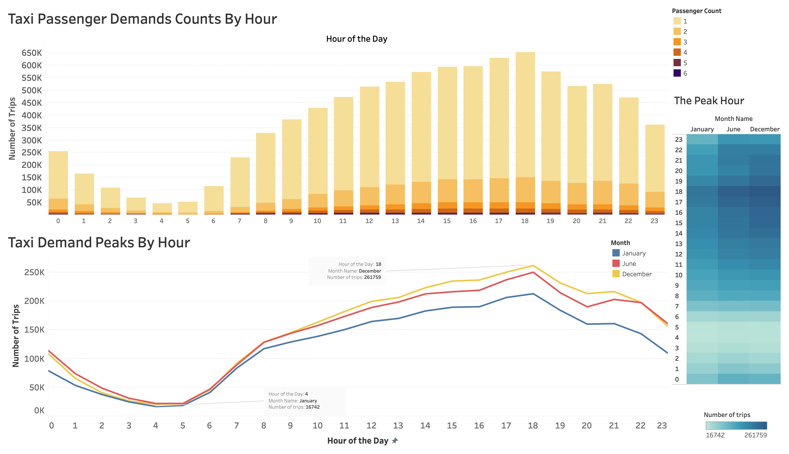
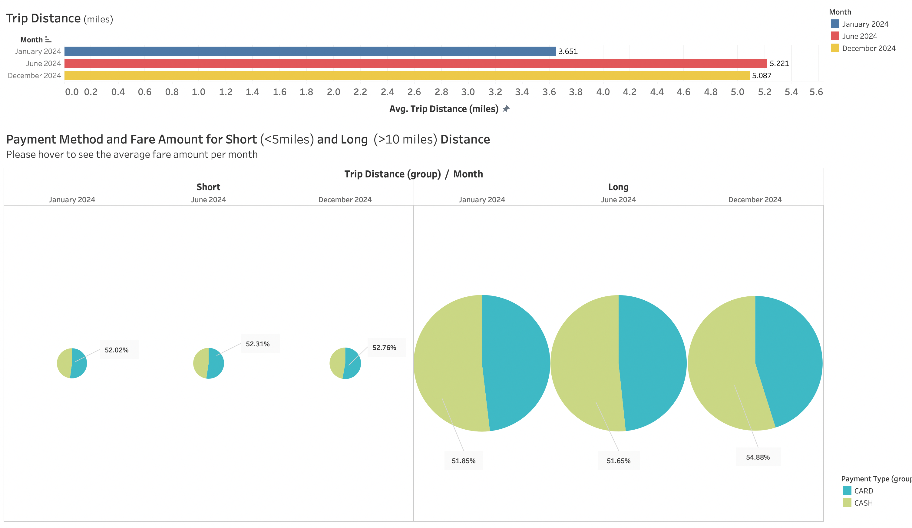
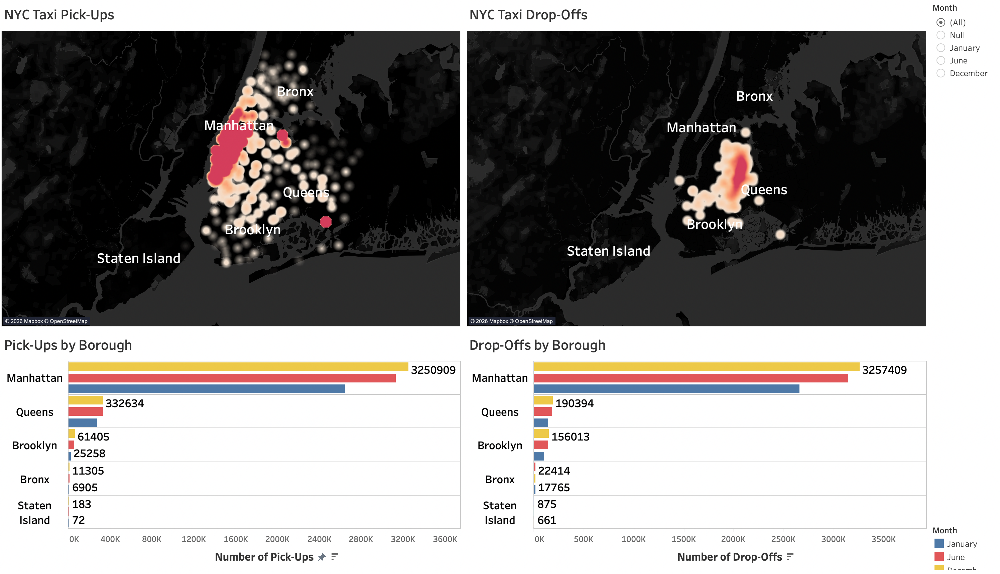

# NYC Taxi Data Dashboard

## Project Overview

This project explores NYC taxi trip data using Tableau to identify travel patterns, payment behaviour, and seasonal trends.

The goal of this analysis is to demonstrate how data visualisation can uncover insights from transportation data.

---

## Dataset

NYC Taxi Trip Dataset containing variables such as:

• Trip distance  
• Fare amount  
• Payment type  
• Pickup borough  
• Trip date  

---

## Tools Used

Tableau  
Data visualisation  

---

## Dashboard Features

The dashboard allows users to explore:

• Trip distance distribution  
• Payment type comparisons  
• Seasonal trip patterns  
• Borough travel activity  

---

## Key Insights

• June showed the longest average trip distances  
• Card payments were used more frequently than cash  
• Travel patterns vary across boroughs  

---

## Dashboard Preview

### Dashboard 1 – Trip Distance Analysis

---

### Dashboard 2 – Payment Type Analysis

---

### Dashboard 3 – Seasonal Travel Patterns

